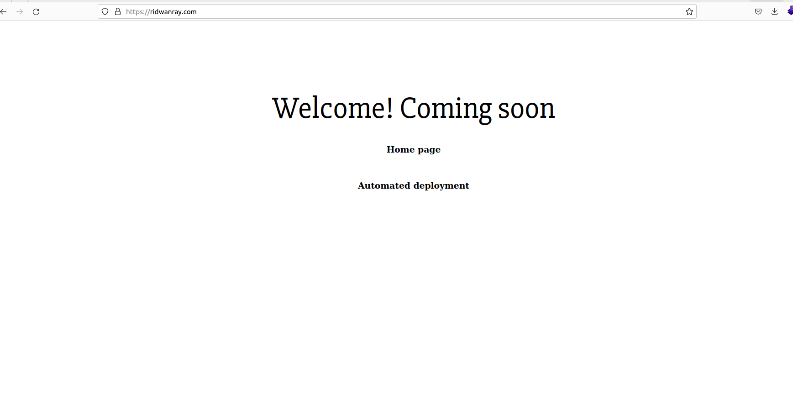

# Deploying Static Websites and SPAs (React/Vue/Angular) on AWS S3 Buckets
This guide provide a comprehensive step-by-step guide on how to deploy static websites
to AWS S3 Buckets
# Setup & Tools

1. AWS S3 bucket - to store files and folders
2. CloudFront - AWS CDN for fast content delivery
3. Route 53 - for managing CNAME/A records, etc.
4. IAM User - to create a user with S3 and CloudFront access
5. Certificate Manager - for securing connection with TLS (i.e., https)
6. GitAction - for automated deployment

